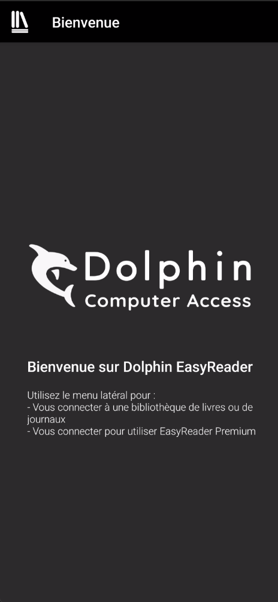
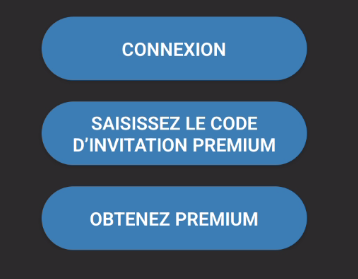
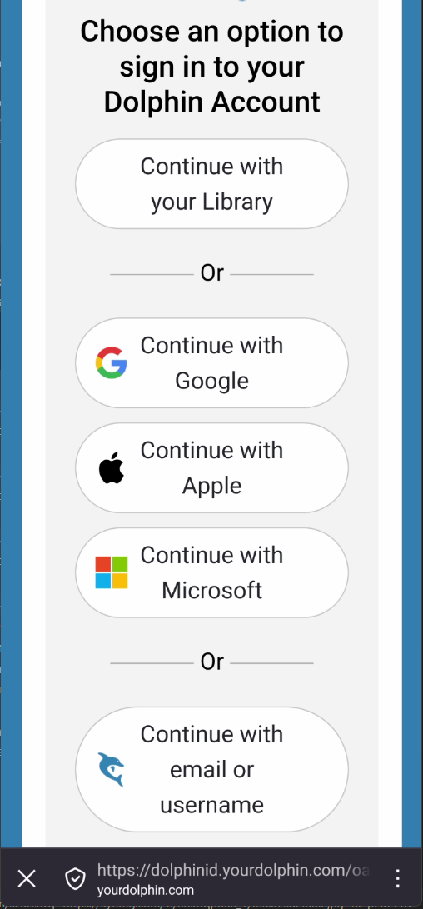

---
tags:
  - EasyReader
  - tutoriel
  - application
  - interface
---
### 🔓 **Première ouverture**

- **Objectif :** Aider l'utilisateurice à démarrer avec l'application.
	
- Actions : 
	 **Ouvrir l'application pour la première fois**
	- Au premier lancement, il est recommandé d'utiliser un compte que vous possédez déjà pour une connexion simple et rapide.
		
		1. **Lancement :** Ouvrez l'application EasyReader.
			 
		    
		2. **Choix de la connexion :** 
			1. Cliquez sur l'icon dans le coins supérieur Gauche de l'écran. Cela ouvre le menu via un volet latéral.
			2. sélectionnez l'icon supérieur Connexion

			    

			3. 3 choix s'offrent à vous. Lier des comptes ou lier son compte premium Dolphin. Nous allons plutôt utiliser le principe de connexion afin de pouvoir utiliser EasyReader en version libre.

				

			4. Le navigateur interne de l'application va s'ouvrir sur une validation de lien de compte. Choisissez de continuer avec l'un des services suivants :

				
			    
		    	- ***Continuer avec Google***
			    	- entrer les informations de votre compte Google si demandé
		        
		    	- ***Continuer avec Apple*** (sur appareils iOS)
			    	- Entrer les informations de votre compte Apple si demandé
		        
		    	- ***Continuer avec Microsoft***
			 		- Entrer les informations de votre compte Microsoft si demandé
				
				- ***Créer un compte Dolphin***
					-  Renseigner une adresse email
					-  Un mot de passe
					-  Dans la boite mail, valider le compte en suivant les instructions du fournisseur Dophin.

		3. **Autorisation :** Une fenêtre s'ouvrira pour vous demander d'autoriser EasyReader. Suivez les instructions défini par le fournisseur d'accès au compte.
		    
		4. **Accès direct :** Une fois l'autorisation accordée, vous serez connecté directement à EasyReader.
