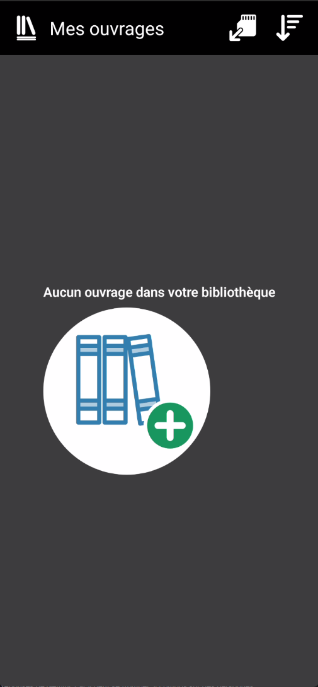
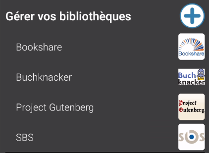
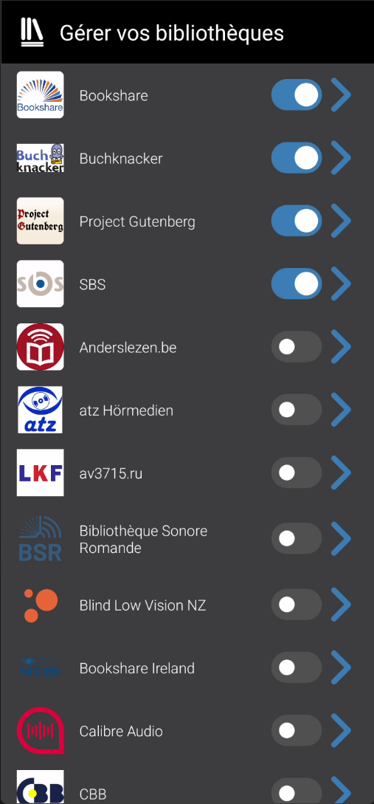
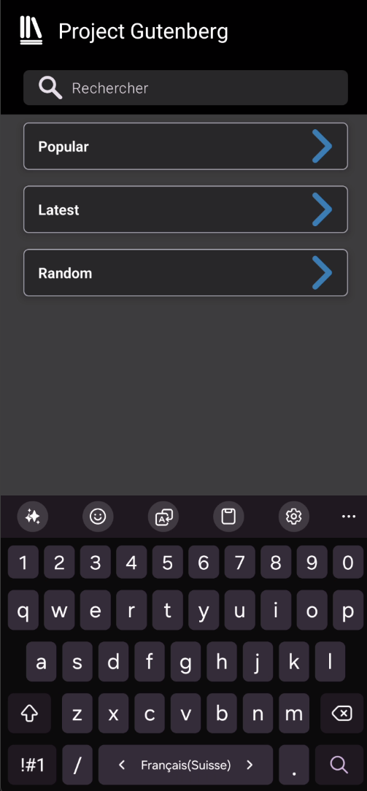

---
tags:
  - EasyReader
  - tutoriel
  - bibliothèque
  - livres
  - téléchargement
---
- **Objectif :** Guider l'utilisateur pour trouver et télécharger son premier livre depuis l'une des nombreuses bibliothèques en ligne accessibles dans EasyReader.

_Votre bibliothèque "Mes ouvrages" est actuellement vide. Il est temps de la remplir ! EasyReader donne accès à des milliers de livres numériques via des bibliothèques partenaires. Suivez ces étapes pour télécharger votre premier ouvrage._
	

#### **Étape 1 : Accéder au menu des bibliothèques**

1. **Ouvrir le menu latéral :** Depuis l'écran principal "Mes ouvrages", appuyez sur l'icône du menu **☰** située dans le coin supérieur gauche. C'est la même icône que vous avez utilisée pour vous connecter.
	 
2. **Gérer les bibliothèques :** Dans le menu qui s'ouvre, vous verrez une liste d'options. Appuyez sur le + à droite de  **"Gérer les bibliothèques"**.

    

#### **Étape 2 : Choisir et activer une bibliothèque**

1. **Activer une bibliothèque :** Assurez-vous que le bouton à côté de la bibliothèque souhaitée est activé (il apparaît en bleu). Cela l'ajoute à votre menu principal pour un accès rapide. Vous pouvez désactiver celles qui ne vous intéressent pas.
    
    
    > [!tip] Suggestion pour un premier essai 
    > Le **"Projet Gutenberg"** est un excellent choix pour débuter. Il offre des milliers de livres gratuits (libres de droits) et ne requiert aucune inscription.
2. **Sélectionner le Projet Gutenberg :** Appuyez sur "Projet Gutenberg" dans la liste pour l'ajouter à votre menu latéral si ce n'est pas déjà fait, puis sélectionnez le depuis le menu général.

#### **Étape 3 : Rechercher et télécharger un livre**

Une fois dans la bibliothèque, vous pouvez chercher des livres.

1. **Lancer une recherche :** Utilisez la barre de recherche pour taper le nom d'un auteur (ex: "Jules Verne") ou un titre (ex: "Vingt mille lieues sous les mers") et validez
    
2. **Parcourir les résultats :** Une liste de livres correspondant à votre recherche s'affichera. Chaque résultat montre généralement le titre, l'auteur et la couverture.

	> [!tip] Astuce : Rechercher dans une langue spécifique
	> Le Projet Gutenberg contient des livres dans de nombreuses langues. Pour trouver un livre en français, vous pouvez soit rechercher directement le titre en français (par exemple, "Le Comte de Monte-Cristo"), soit ajouter "french" à votre recherche (par exemple, "Alexandre Dumas french")
3. **Télécharger le livre :**
    
    - Appuyez sur le livre qui vous intéresse pour voir plus de détails.
        
    - Trouvez et appuyez sur le bouton **"Télécharger"**. 
      
        

#### **Étape 4 : Retrouver votre livre**

Une fois le téléchargement terminé, le livre est ajouté à votre bibliothèque personnelle.

1. **Retourner à "Mes ouvrages" :** Utilisez le menu latéral **☰** et sélectionnez "Mes ouvrages".
    
2. **Félicitations !** Votre nouveau livre apparaît maintenant sur l'étagère de "Mes livres", prêt à être ouvert. 
    

> [!note] Prochaine étape : La lecture Maintenant que vous avez un livre, la prochaine section du tutoriel vous montrera comment l'ouvrir, naviguer entre les pages et personnaliser l'affichage pour un confort de lecture optimal.